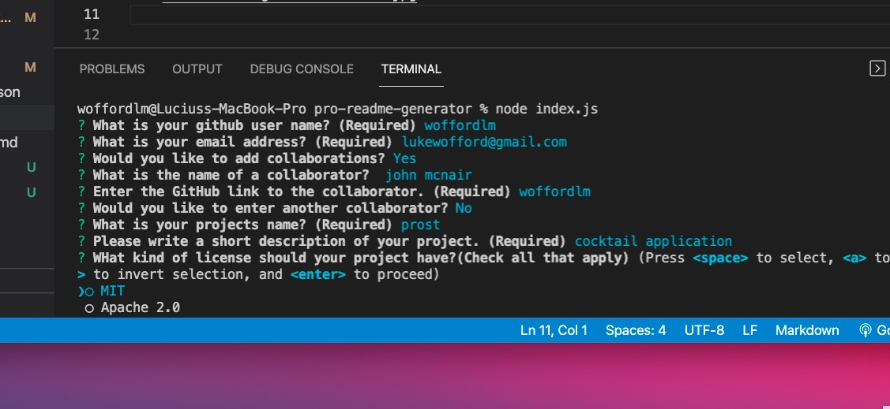

<h1> Pro-ReadMe-Generator </h1>

## Description
This application generates data through prompting the user with questions related to building a readme documentation. After running through all of the questions a new file will be created in the dist file.

## Demo
[Video Demo](https://www.youtube.com/watch?v=SFVUS8uO39A)


## Screenshots




## Table of Contents
  - [Description](#description)
  - [Installation](#installation)
  - [Usage](#usage)
  - [License](#license)
  - [Contributing](#contributing)
  - [Tests](#tests)
  - [Questions](#questions)

## Installation
The following command will download dependencies <br>
``` npm i ```

## Usage
The following command will initiate the application. <br>
``` node index.js ``` 

## License 
This repo holds no license

## Questions
If you have any questions feel free to contact me at lukewofford@gmail.com <br>
Or checkout my other work at [woffordlm](https://github.com/woffordlm)


